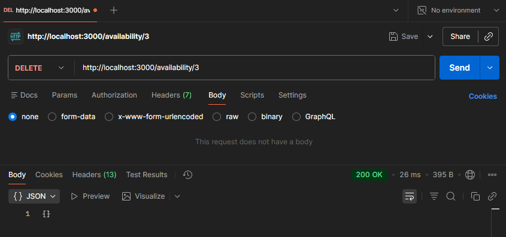

# DELETE /availability

Use the `DELETE` method to permanently delete an existing availability information associated with a coliving or coworking space.

## Endpoint

```shell
DELETE /availability/{id}
```

## Request body

None.

## Parameters

| Parameter | Type | Required | Description |
|-----------|------|----------|-------------|
| `id`  | number | Yes | The unique identifier of the availability to delete |

## Responses

| HTTP Code | Description | Schema |
|-----------|-------------|--------|
| 200 | Availability deleted successfully. | `success` - empty object |
| 404 | Availability not found. | `error` object |

## Example request

### cURL

```bash
curl -X DELETE http://localhost:3000/availability/3
```

#### Postman

1. Set method to `DELETE`
1. Enter URL: `http://localhost:3000/availability/3`
1. Ensure **Body** is set to **none**.
1. Click **Send**

    

### Example response

```json
{}
```
